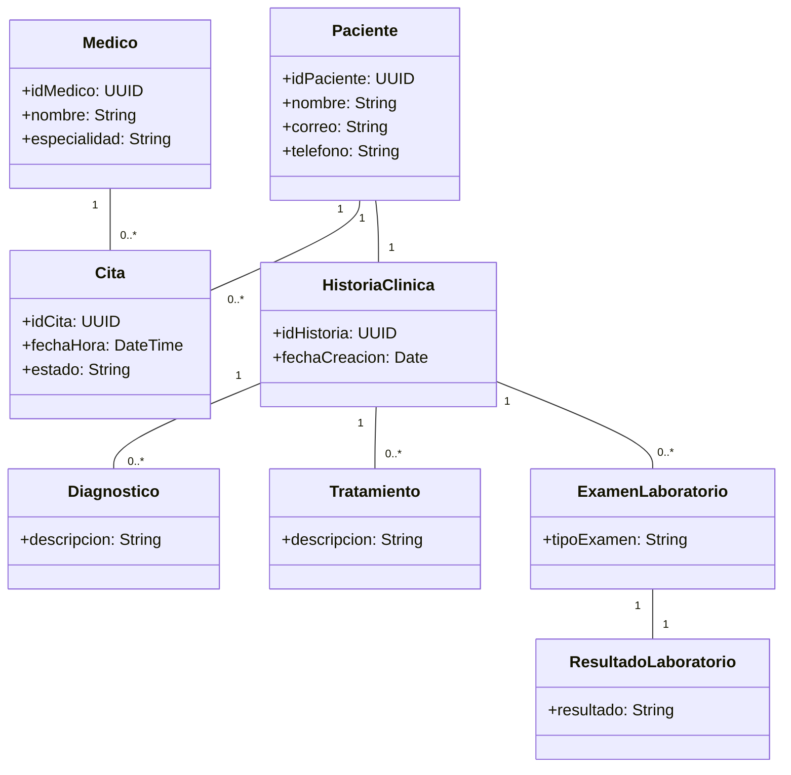
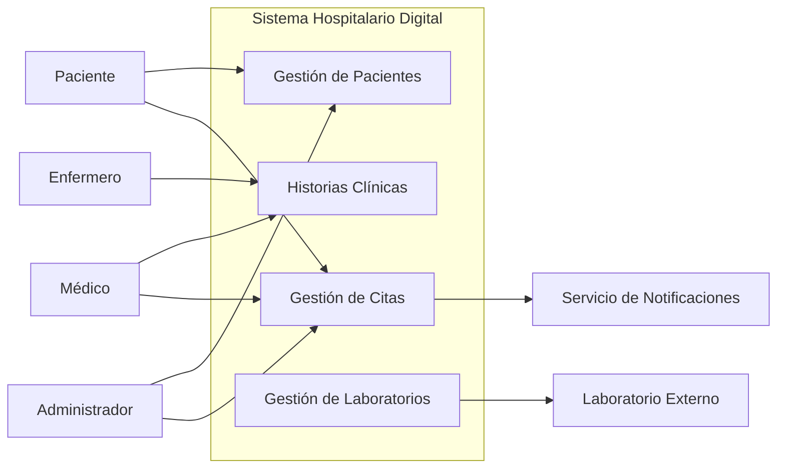
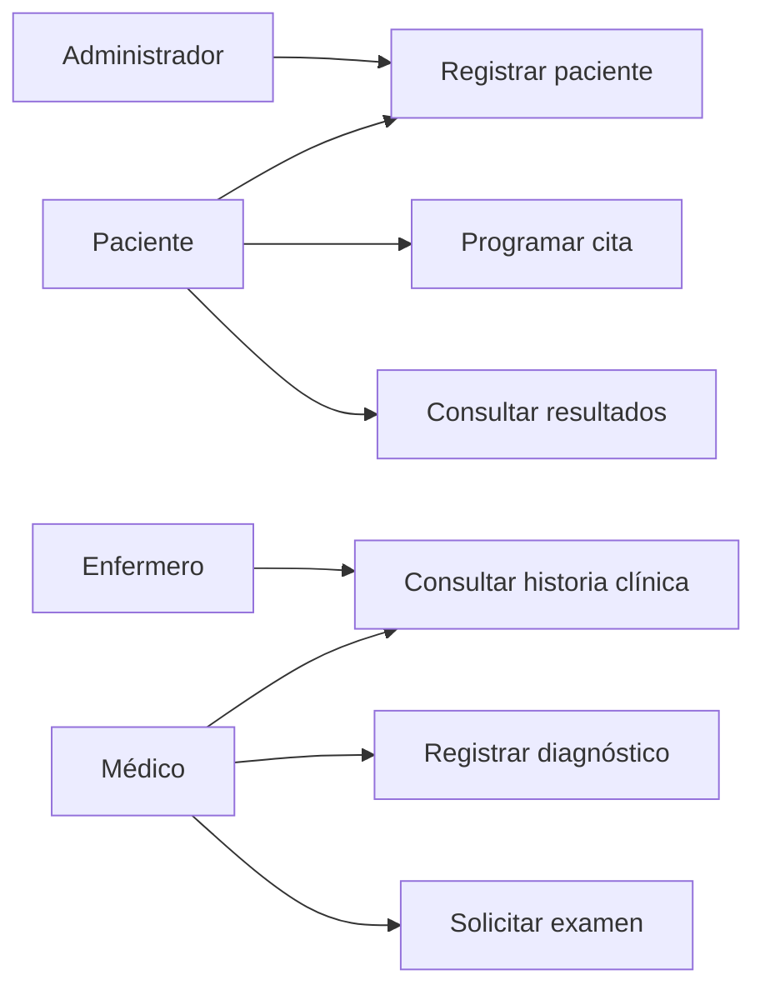
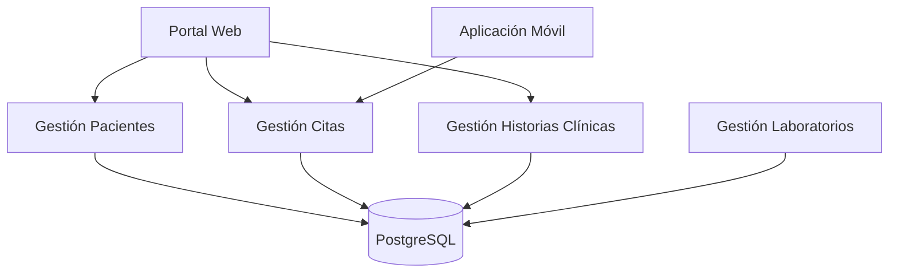
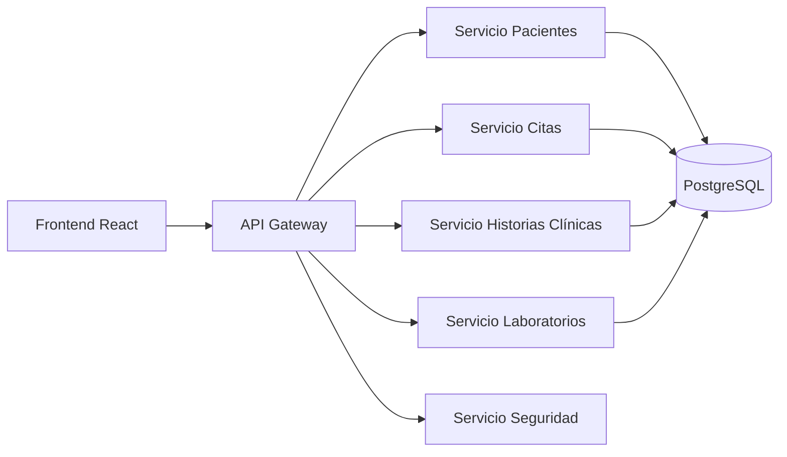
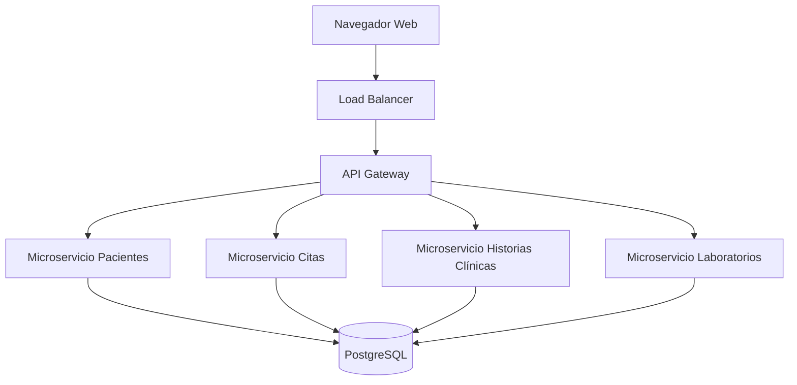

# Documento de Especificación Arquitectónica de Software (SAD)

# Sistema Hospitalario Digital

## Portada

**Proyecto:** Sistema Hospitalario Digital

**Metodología:** Rational Unified Process (RUP)

**Modelo Arquitectónico:** Modelo 4+1 de Kruchten

**Autores:** Equipo de Trabajo

**Asignatura:** Arquitectura del Software

**Universidad:** Universidad de Manizales

**Fecha:** Agosto 2026

---

# Tabla de Contenidos

1. Introducción
2. Documento de Visión y Especificación de Requisitos
3. Modelo Conceptual y Decisiones Arquitectónicas
4. Vistas Arquitectónicas
5. Consolidación de la Especificación Arquitectónica
6. Conclusiones
7. Referencias Bibliográficas

---

# 1. Introducción

## 1.1 Propósito

El presente documento tiene como propósito definir la arquitectura del Sistema Hospitalario Digital, describiendo los requisitos funcionales y no funcionales, las decisiones arquitectónicas, los componentes del sistema y las vistas arquitectónicas necesarias para comprender su estructura, comportamiento y evolución.

## 1.2 Alcance del Documento

Este documento cubre la especificación arquitectónica del sistema utilizando los lineamientos de RUP y el modelo 4+1 de Kruchten, con enfoque en la gestión clínica, la atención de pacientes y la integración de servicios hospitalarios.

## 1.3 Acrónimos

| Acrónimo | Definición |
|-----------|-----------|
| SAD | Software Architecture Document |
| UML | Unified Modeling Language |
| API | Application Programming Interface |
| JWT | JSON Web Token |
| RUP | Rational Unified Process |
| HL7 | Health Level Seven |
| FHIR | Fast Healthcare Interoperability Resources |

---

# 2. Documento de Visión y Especificación de Requisitos

## 2.1 Descripción del Problema

Las instituciones de salud requieren administrar grandes volúmenes de información clínica, garantizando seguridad, disponibilidad y acceso oportuno a los datos. Los sistemas tradicionales presentan problemas de duplicidad de información, errores de atención, baja trazabilidad y dificultades para consultar historias clínicas en tiempo real.

## 2.2 Objetivos

### Objetivo General

Diseñar una arquitectura de software segura, escalable y confiable para la gestión hospitalaria digital.

### Objetivos Específicos

- Gestionar pacientes.
- Administrar historias clínicas.
- Programar citas médicas.
- Integrar laboratorios clínicos.
- Garantizar la confidencialidad de la información.
- Cumplir las normativas de protección de datos.

## 2.3 Alcance

### Dentro del Alcance

- Gestión de pacientes.
- Historias clínicas.
- Citas médicas.
- Integración con laboratorios.
- Seguridad y auditoría.

### Fuera del Alcance

- Facturación.
- Nómina.
- Gestión financiera.

## 2.4 Stakeholders

| Stakeholder | Rol |
|------------|------|
| Paciente | Usuario final |
| Médico | Atención clínica |
| Enfermero | Apoyo asistencial |
| Administrador | Gestión operativa |
| Laboratorio | Procesamiento de exámenes |
| Equipo TI | Soporte tecnológico |

## 2.5 Módulos Funcionales

1. Gestión de Pacientes
2. Historias Clínicas
3. Gestión de Citas
4. Laboratorios
5. Seguridad y Auditoría

## 2.6 Requisitos Funcionales

### Gestión de Pacientes

- RF-PAC-01 Registrar paciente.
- RF-PAC-02 Actualizar información.
- RF-PAC-03 Consultar historial.

### Historias Clínicas

- RF-HC-01 Crear historia clínica.
- RF-HC-02 Registrar diagnósticos.
- RF-HC-03 Registrar tratamientos.
- RF-HC-04 Consultar historia clínica.

### Citas

- RF-CIT-01 Programar cita.
- RF-CIT-02 Reprogramar cita.
- RF-CIT-03 Cancelar cita.
- RF-CIT-04 Notificar recordatorios.

### Laboratorios

- RF-LAB-01 Solicitar examen.
- RF-LAB-02 Registrar resultado.
- RF-LAB-03 Consultar resultado.

### Seguridad

- RF-SEG-01 Autenticar usuarios.
- RF-SEG-02 Gestionar roles.
- RF-SEG-03 Auditar operaciones.

## 2.7 Requisitos No Funcionales

### Seguridad

- RNF-SEG-01 Comunicación mediante HTTPS/TLS 1.3.
- RNF-SEG-02 Contraseñas cifradas.

### Disponibilidad

- RNF-DIS-01 Disponibilidad mínima de 99.9%.

### Rendimiento

- RNF-REN-01 Consultas menores a 2 segundos.

### Escalabilidad

- RNF-ESC-01 Soportar 5000 usuarios concurrentes.

### Mantenibilidad

- RNF-MAN-01 Arquitectura basada en microservicios.

## 2.8 Restricciones

### Técnicas

- Docker.
- Kubernetes.
- PostgreSQL.
- API REST.

### Organizacionales

- Cumplimiento de Habeas Data.
- Normativas de salud.

---

# 3. Modelo Conceptual y Decisiones Arquitectónicas

## 3.1 Modelo Conceptual del Dominio

## 3.2 Estilo Arquitectónico

### Arquitectura basada en Microservicios

- Servicio de Pacientes
- Servicio de Historias Clínicas
- Servicio de Citas
- Servicio de Laboratorios
- Servicio de Seguridad

## 3.3 Decisiones Arquitectónicas

### ADR-01

Arquitectura basada en microservicios.

### ADR-02

Database per Service.

### ADR-03

Autenticación mediante JWT y RBAC.

### ADR-04

Comunicación mediante API REST.

---

# 4. Vistas Arquitectónicas

## 4.1 Vista de Contexto

## 4.2 Vista Conceptual

## 4.3 Vista de Casos de Uso

## 4.4 Vista Lógica

## 4.5 Vista de Implementación

## 4.6 Vista Física (Despliegue)

---

# 5. Consolidación de la Especificación Arquitectónica

## 5.1 Matriz de Trazabilidad

| Requisito | ADR | Vista |
|------------|------|--------|
| RF-PAC-01 | ADR-01 | Lógica |
| RF-HC-01 | ADR-01 | Conceptual |
| RF-CIT-01 | ADR-04 | Casos de Uso |
| RF-LAB-02 | ADR-02 | Implementación |
| RNF-SEG-01 | ADR-03 | Física |

## 5.2 Verificación de Coherencia

La arquitectura propuesta mantiene consistencia entre los requisitos funcionales, los requisitos no funcionales, las decisiones técnicas y las vistas arquitectónicas. Cada componente del sistema responde a objetivos de seguridad, disponibilidad, escalabilidad y mantenibilidad, evitando redundancias y contradicciones en la estructura general.

## 5.3 Justificación de Atributos de Calidad

### Seguridad

Se implementa mediante HTTPS, JWT y control de acceso basado en roles, lo que permite proteger la información clínica y limitar el acceso a usuarios autorizados.

### Escalabilidad

La solución se apoya en microservicios y contenedores, permitiendo ampliar capacidades sin afectar de manera crítica el funcionamiento del sistema completo.

### Disponibilidad

La arquitectura contempla balanceo de carga, despliegue distribuido y redundancia mínima de servicios para garantizar continuidad operativa.

### Mantenibilidad

La separación de responsabilidades entre servicios facilita la evolución del sistema, la incorporación de nuevas funcionalidades y el mantenimiento por módulos.

---

# 6. Conclusiones

La arquitectura propuesta permite gestionar de forma eficiente los procesos hospitalarios mediante una solución basada en microservicios, favoreciendo la escalabilidad, la disponibilidad y la seguridad de la información clínica. La separación funcional por dominios permite reducir acoplamientos, mejorar trazabilidad y facilitar futuras extensiones del sistema.

La utilización del modelo 4+1 facilita la comprensión de la arquitectura desde distintas perspectivas, proporcionando una guía clara para el desarrollo, implementación y evolución del Sistema Hospitalario Digital.

---

# 7. Referencias Bibliográficas

- Kruchten, P. Architectural Blueprints: The 4+1 View Model.
- Bass, Clements & Kazman. Software Architecture in Practice.
- Rational Unified Process (RUP).
- ISO/IEC/IEEE 42010.
- HL7 FHIR Documentation.
