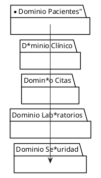

# Documento de Especificación Arquitectónica de Software (SAD)

# Sistema Hospitalario Digital

## Portada

**Proyecto:** Sistema Hospitalario Digital

**Metodología:** Rational Unified Process (RUP)

**Modelo Arquitectónico:** Modelo 4+1 de Kruchten

**Autores:** Equipo de trabajo

**Asignatura:** Arquitectura del Software

**Universidad:** Universidad de Manizales

**Fecha:** Agosto 2026

---

# Tabla de Contenidos

1. Introducción
2. Documento de Visión y Especificación de Requisitos
3. Modelo Conceptual y Decisiones Arquitectónicas
4. Vistas Arquitectónicas
5. Consolidación de la Especificación Arquitectónica
6. Conclusiones
7. Referencias

---

# 1. Introducción

## 1.1 Propósito

El presente documento tiene como propósito definir la arquitectura del Sistema Hospitalario Digital, describiendo los requisitos funcionales y no funcionales, las decisiones arquitectónicas, los componentes del sistema y las vistas arquitectónicas necesarias para comprender su estructura y funcionamiento.

## 1.2 Alcance del Documento

Este documento cubre la especificación arquitectónica del sistema utilizando los lineamientos de RUP y el modelo 4+1 de Kruchten.

## 1.3 Acrónimos

| Acrónimo | Definición |
|-----------|-----------|
| SAD | Software Architecture Document |
| UML | Unified Modeling Language |
| API | Application Programming Interface |
| JWT | JSON Web Token |
| RUP | Rational Unified Process |
| HL7 | Health Level Seven |
| FHIR | Fast Healthcare Interoperability Resources |

---

# 2. Documento de Visión y Especificación de Requisitos

## 2.1 Descripción del Problema

Las instituciones de salud requieren administrar grandes volúmenes de información clínica garantizando seguridad, disponibilidad y acceso oportuno a los datos. Los sistemas tradicionales generan problemas de duplicidad de información, errores de atención y dificultades de acceso a historias clínicas.

## 2.2 Objetivos

### Objetivo General

Diseñar una arquitectura de software segura, escalable y confiable para la gestión hospitalaria digital.

### Objetivos Específicos

- Gestionar pacientes.
- Administrar historias clínicas.
- Programar citas médicas.
- Integrar laboratorios clínicos.
- Garantizar la confidencialidad de la información.
- Cumplir las normativas de protección de datos.

## 2.3 Alcance

### Dentro del Alcance

- Gestión de pacientes.
- Historias clínicas.
- Citas médicas.
- Integración con laboratorios.
- Seguridad y auditoría.

### Fuera del Alcance

- Facturación.
- Nómina.
- Gestión financiera.

---

## 2.4 Stakeholders

| Stakeholder | Rol |
|------------|------|
| Paciente | Usuario final |
| Médico | Atención clínica |
| Enfermero | Apoyo asistencial |
| Administrador | Gestión operativa |
| Laboratorio | Procesamiento de exámenes |
| Equipo TI | Soporte tecnológico |

---

## 2.5 Módulos Funcionales

1. Gestión de Pacientes
2. Historias Clínicas
3. Gestión de Citas
4. Laboratorios
5. Seguridad y Auditoría

---

## 2.6 Requisitos Funcionales

### Gestión de Pacientes

- RF-PAC-01 Registrar paciente.
- RF-PAC-02 Actualizar información.
- RF-PAC-03 Consultar historial.

### Historias Clínicas

- RF-HC-01 Crear historia clínica.
- RF-HC-02 Registrar diagnósticos.
- RF-HC-03 Registrar tratamientos.
- RF-HC-04 Consultar historia clínica.

### Citas

- RF-CIT-01 Programar cita.
- RF-CIT-02 Reprogramar cita.
- RF-CIT-03 Cancelar cita.
- RF-CIT-04 Notificar recordatorios.

### Laboratorios

- RF-LAB-01 Solicitar examen.
- RF-LAB-02 Registrar resultado.
- RF-LAB-03 Consultar resultado.

### Seguridad

- RF-SEG-01 Autenticar usuarios.
- RF-SEG-02 Gestionar roles.
- RF-SEG-03 Auditar operaciones.

---

## 2.7 Requisitos No Funcionales

### Seguridad

- RNF-SEG-01 Comunicación mediante HTTPS/TLS 1.3.
- RNF-SEG-02 Contraseñas cifradas.

### Disponibilidad

- RNF-DIS-01 Disponibilidad mínima de 99.9%.

### Rendimiento

- RNF-REN-01 Consultas menores a 2 segundos.

### Escalabilidad

- RNF-ESC-01 Soportar 5000 usuarios concurrentes.

### Mantenibilidad

- RNF-MAN-01 Arquitectura basada en microservicios.

---

## 2.8 Restricciones

### Técnicas

- Docker.
- Kubernetes.
- PostgreSQL.
- API REST.

### Organizacionales

- Cumplimiento de Habeas Data.
- Normativas de salud.

---

# 3. Modelo Conceptual y Decisiones Arquitectónicas

## 3.1 Modelo Conceptual del Dominio


classDiagram

class Paciente{
    +UUID idPaciente
    +String nombre
    +String correo
    +String telefono
}

class Medico{
    +UUID idMedico
    +String nombre
    +String especialidad
}

class Cita{
    +UUID idCita
    +DateTime fechaHora
    +String estado
}

class HistoriaClinica{
    +UUID idHistoria
    +Date fechaCreacion
}

class Diagnostico{
    +String descripcion
}

class Tratamiento{
    +String descripcion
}

class ExamenLaboratorio{
    +String tipoExamen
}

class ResultadoLaboratorio{
    +String resultado
}

Paciente "1" --> "0..*" Cita
Medico "1" --> "0..*" Cita
Paciente "1" --> "1" HistoriaClinica

HistoriaClinica "1" --> "0..*" Diagnostico
HistoriaClinica "1" --> "0..*" Tratamiento
HistoriaClinica "1" --> "0..*" ExamenLaboratorio

Examen*aboratorio "1" --> "1" ResultadoLa*oratorio


---

# 4.2 Vista Conceptu*l



---

# 4*3 Vista de Casos de Uso

```plantu*l
@startuml

left to right directi*n

actor Paciente
actor Medico
act*r Administrador

usecase "Registra* Paciente"
usecase "Programar Cita*
usecase "Consultar Historia Clíni*a"
usecase "Registrar Diagnóstico"*usecase "Solicitar Examen"
usecase*"Consultar Resultados"

Administra*or --> "Registrar Paciente"
Pacien*e --> "Programar Cita"
Paciente --* "Consultar Resultados"

Medico --* "Consultar Historia Clínica"
Medi*o --> "Registrar Diagnóstico"
Medi*o --> "Solicitar Examen"

@enduml
*``

---

# 4.4 Vista Lógica

```pl*ntuml
@startuml

package "Presenta*ión" {
    [Portal Web]
    [Aplic*ción Móvil]
}

package "Aplicación* {
    [Pacientes]
    [Citas]
   *[Historias Clínicas]
    [Laborato*ios]
}

package "Persistencia" {
 *  database PostgreSQL
}

[Portal W*b] --> [Pacientes]
[Portal Web] --* [Citas]

[Pacientes] --> PostgreS*L
[Citas] --> PostgreSQL
[Historia* Clínicas] --> PostgreSQL
[Laborat*rios] --> PostgreSQL

@enduml
```
*---

# 4.5 Vista de Implementación*
```plantuml
@startuml

component *Frontend React"

component "API Ga*eway"

component "Servicio Pacient*s"
component "Servicio Citas"
comp*nent "Servicio Historias Clínicas"*component "Servicio Laboratorios"
*omponent "Servicio Seguridad"

dat*base PostgreSQL

"Frontend React" *-> "API Gateway"

"API Gateway" --* "Servicio Pacientes"
"API Gateway* --> "Servicio Citas"
"API Gateway* --> "Servicio Historias Clínicas"*"API Gateway" --> "Servicio Labora*orios"
"API Gateway" --> "Servicio*Seguridad"

"Servicio Pacientes" -*> PostgreSQL
"Servicio Citas" --> *ostgreSQL
"Servicio Historias Clín*cas" --> PostgreSQL
"Servicio Labo*atorios" --> PostgreSQL

@enduml
`*`

---

# 4.6 Vista Física (Despli*gue)

```plantuml
@startuml

node *Cliente" {
    artifact "Navegador*
}

cloud "Infraestructura Cloud" *

    node "Load Balancer"

    no*e "Kubernetes Cluster" {

        *ode "API Gateway"

        node "S*rvicio Pacientes"

        node "Servicio Citas"

        node "Servicio Historias Clínicas"

        node "Servicio Laboratorios"
    }

    database "PostgreSQL"

}

"Navegador" --> "Load Balancer"

"Load Balancer" --> "API Gateway"

"API Gateway" --> "Servicio Pacientes"
"API Gateway" --> "Servicio Citas"
"API Gateway" --> "Servicio Historias Clínicas"
"API Gateway" --> "Servicio Laboratorios"

@enduml
```

---

# 5. Consolidación de la Especificación Arquitectónica

## 5.1 Matriz de Trazabilidad

| Requisito | ADR | Vista |
|------------|------|--------|
| RF-PAC-01 | ADR-01 | Lógica |
| RF-CIT-01 | ADR-01 | Casos de Uso |
| RF-HC-01 | ADR-02 | Implementación |
| RNF-SEG-01 | ADR-03 | Física |

## 5.2 Verificación de Coherencia

La arquitectura garantiza la alineación entre requisitos funcionales, requisitos no funcionales, decisiones arquitectónicas y componentes tecnológicos.

## 5.3 Justificación de Atributos de Calidad

### Seguridad

Implementada mediante HTTPS, JWT y control de acceso basado en roles.

### Escalabilidad

Implementada mediante microservicios desplegados sobre Kubernetes.

### Disponibilidad

Garantizada mediante infraestructura cloud y balanceo de carga.

### Mantenibilidad

Lograda mediante separación de responsabilidades entre servicios.

---

# 6. Conclusiones

La arquitectura propuesta permite gestionar de forma eficiente los procesos hospitalarios mediante una solución basada en microservicios, favoreciendo la escalabilidad, disponibilidad y seguridad de la información clínica.

La utilización del modelo 4+1 facilita la comprensión de la arquitectura desde diferentes perspectivas y proporciona una guía clara para el desarrollo e implementación del sistema.

---

# 7. Referencias Bibliográficas

- Kruchten, P. Architectural Blueprints—The 4+1 View Model.
- Bass, Clements & Kazman. Software Architecture in Practice.
- Rational Unified Process (RUP).
- ISO/IEC/IEEE 42010.
- HL7 FHIR Documentation.